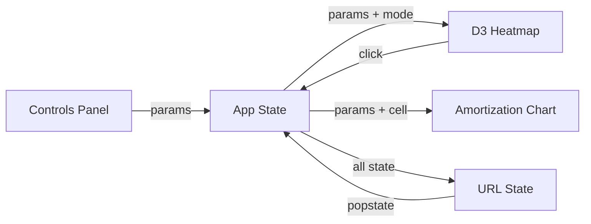

# Mortgage Viz

What does this house actually cost per month? Not the Zillow estimate, not the lender's napkin math — the real number, with tax and insurance and PMI and HOA all baked in, across a grid of prices and tax amounts so you can see the full landscape at once.

 

**[Try it live →](https://aes87.github.io/mortgage-viz/)**

## What It Does

- **Payment heatmap** — 30×30 grid mapping home price (x) against annual property tax (y), color-coded by total monthly payment
- **Rent boundary line** — shows exactly where buying costs more than your current rent
- **Amortization schedule** — click any cell to see the full payoff curve with equity, balance, and total interest over the loan term
- **Affordability overlay** — DTI-based color bands showing comfortable, stretching, maximum, and over-limit zones relative to your income
- **Scenario comparison** — "What if?" tab overlays a second rent boundary with different rate/term/down payment, filled zone between the two lines
- **Shareable URLs** — every parameter encodes into the URL, so you can send someone your exact view

## Quick Start

```bash
git clone https://github.com/aes87/mortgage-viz.git
cd mortgage-viz
npm install
npm run dev
```

Open `http://localhost:5173/mortgage-viz/` — the heatmap renders immediately with sensible defaults.

## How It Works



The controls panel feeds loan parameters into React state. D3 renders a `scaleBand` grid with a custom color interpolation — steel teal through sage to terracotta. The rent boundary is computed by solving for the home price where `totalMonthly == currentRent` at each tax level, then drawing a `d3.line` with monotone interpolation.

Tabs are overlay modes — they modify the heatmap's behavior (affordability tints cells, compare adds a second boundary line) rather than replacing it. Click-to-pin lets you mark up to 5 cells for side-by-side reference.

## Project Structure

```
src/
├── App.jsx                 # Root component, state, tab routing
├── components/
│   ├── Heatmap.jsx         # D3 heatmap + overlays + touch support
│   ├── Controls.jsx        # Sidebar parameter inputs
│   ├── AmortizationChart.jsx
│   ├── AffordabilityControls.jsx
│   ├── TabBar.jsx
│   ├── SummaryStats.jsx
│   └── ExportButton.jsx    # SVG → Canvas → PNG export
├── utils/
│   ├── mortgage.js         # Pure calculation functions
│   └── urlState.js         # URL encode/decode
└── styles/
    └── index.css           # Vintage infographic theme (CSS custom properties)
```

## Background

Rebuilt from a MATLAB tool I wrote as a first-time buyer — same brute-force grid approach, new stack. The original took a weekend of MATLAB wrangling and helped me buy a house. Then it sat on a hard drive for years. This version was built entirely through iterative conversation with Claude — architecture, D3 integration, visual design, the works. Three parallel review agents handled aesthetics, usability, and utility before a second pass synthesized their feedback.

## Configuration

All parameters are adjustable in the sidebar:

| Parameter | Range | Default |
|:----------|:------|:--------|
| Interest rate | 1–12% | 6.50% |
| Loan term | 15 or 30 yr | 30 yr |
| Down payment | 0–50% | 20% |
| Insurance rate | 0–2% | 0.50% |
| Monthly HOA | $0–800 | $0 |
| Current rent | $500–8,000 | $2,500 |

Axis ranges (price and tax) are also configurable — useful for zooming into a specific market.

## Tech Stack

React 19 · Vite · D3.js · CSS custom properties · GitHub Pages

## License

MIT
