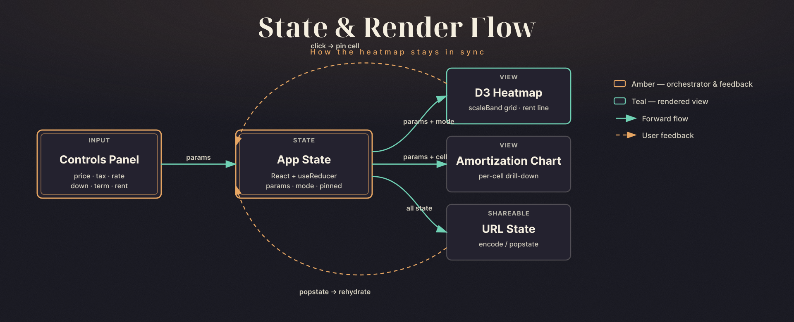

# Mortgage Viz

What does this house actually cost per month? Not the Zillow estimate, not the lender's napkin math — the real number, with tax and insurance and PMI and HOA all baked in, across a grid of prices and tax amounts so you can see the full landscape at once.

 

**[Try it live → lab.mattharte.com/mortgage-viz](https://lab.mattharte.com/mortgage-viz/)**

## What It Does

- **Editorial scroll** — hero, thesis, the tool itself, a per-cell drilldown, and a methodology section. Built to read, not just to operate.
- **Payment heatmap** — 30×30 grid mapping home price (x) against annual property tax (y), color-coded by total monthly payment via an OKLCH sage→ember→clay ramp.
- **Rent boundary line** — solves for the price where buying matches your current rent, drawn across the grid in sage.
- **Per-cell drilldown** — click any cell to see a stacked monthly composition (P&I / tax / insurance / HOA / PMI) alongside the full thirty-year amortization curve.
- **Affordability overlay** — DTI-based color bands using the editorial state palette (fern / saffron / clay / garnet) relative to your income.
- **Scenario comparison** — "What if?" overlays a second rent-boundary line with different rate/term/down payment, with the filled zone between scenario A and B.
- **Methodology** — the P&I formula, the variables, the assumptions the math doesn't make.
- **Shareable URLs** — every parameter encodes into the URL, plus a copy-link button.

## Quick Start

```bash
git clone https://github.com/harteWired/mortgage-viz.git
cd mortgage-viz
npm install
npm run dev
```

Open `http://localhost:5173/mortgage-viz/` — the heatmap renders immediately with sensible defaults.

## How It Works



Loan parameters flow from the inline controls into React state. D3 renders a `scaleBand` grid with a custom OKLCH interpolation (`sage → ember → clay`) — perceptually uniform, anchored to the four-tier editorial palette that the rest of [`lab.mattharte.com`](https://lab.mattharte.com/) uses. The rent boundary is computed by solving for the home price where `totalMonthly == currentRent` at each tax level, then drawn with monotone interpolation.

Tabs are overlay modes — they modify the heatmap's behavior (affordability tints cells, compare adds a second boundary line) rather than replacing it. Clicking any cell smooth-scrolls to the drilldown section and pins the cell in the right rail (up to five).

## Project Structure

```
src/
├── App.jsx                  # Root: state, scroll layout, theme, share
├── components/
│   ├── Hero.jsx             # 100svh hero with morphing blobs + char-stagger entrance
│   ├── Nav.jsx              # Top nav, .app-nav--scrolled fades on scroll
│   ├── Thesis.jsx           # Editorial lead before the tool
│   ├── Heatmap.jsx          # D3 heatmap + overlays + touch support
│   ├── Controls.jsx         # Inline parameter inputs
│   ├── AmortizationChart.jsx
│   ├── BreakdownStack.jsx   # P&I / tax / insurance / HOA / PMI stacked bar
│   ├── PinnedCellsCard.jsx  # Right-rail pins
│   ├── AffordabilityControls.jsx
│   ├── CompareControls.jsx
│   ├── TabBar.jsx
│   ├── SummaryStats.jsx
│   ├── ExportButton.jsx     # SVG → Canvas → PNG export
│   ├── Methodology.jsx      # Formula + assumptions
│   └── Footer.jsx
├── utils/
│   ├── mortgage.js          # Pure calculation functions
│   └── urlState.js          # URL encode/decode
└── styles/
    ├── _shell.css           # portfolio-shell.css v1.1.0 (verbatim)
    ├── _app.css             # mortgage-viz-specific editorial styles
    └── index.css            # Importer
worker/
└── worker.js                # Cloudflare Worker (lab subdomain prefix-strip)
gh-pages-redirect/
└── index.html               # Meta-refresh stub for the legacy GH Pages URL
wrangler.jsonc               # Cloudflare Worker config
```

## Background

Rebuilt from a MATLAB tool I wrote as a first-time buyer — same brute-force grid approach, new stack. The original took a weekend of MATLAB wrangling and helped me buy a house. Then it sat on a hard drive for years.

v1 was built entirely through iterative conversation with Claude — architecture, D3 integration, visual design. v2 (this version) is the editorial overhaul: re-skinned to the lab.mattharte.com palette and rebuilt as a scrollable editorial page so a cold visitor reads the thesis, sees the tool, drills into a cell, and understands the math — in that order.

## Configuration

All parameters live in the inline controls below the heatmap:

| Parameter | Range | Default |
|:----------|:------|:--------|
| Interest rate | 1–12% | 6.50% |
| Loan term | 15 or 30 yr | 30 yr |
| Down payment | 0–50% | 20% |
| Insurance rate | 0–2% | 0.50% |
| Monthly HOA | $0–800 | $0 |
| Current rent | $500–8,000 | $2,500 |

Axis ranges (price and tax) are also configurable — useful for zooming into a specific market.

## Tech Stack

React 19 · Vite · D3.js · CSS custom properties (OKLCH) · Cloudflare Workers · GitHub Actions

## License

MIT
